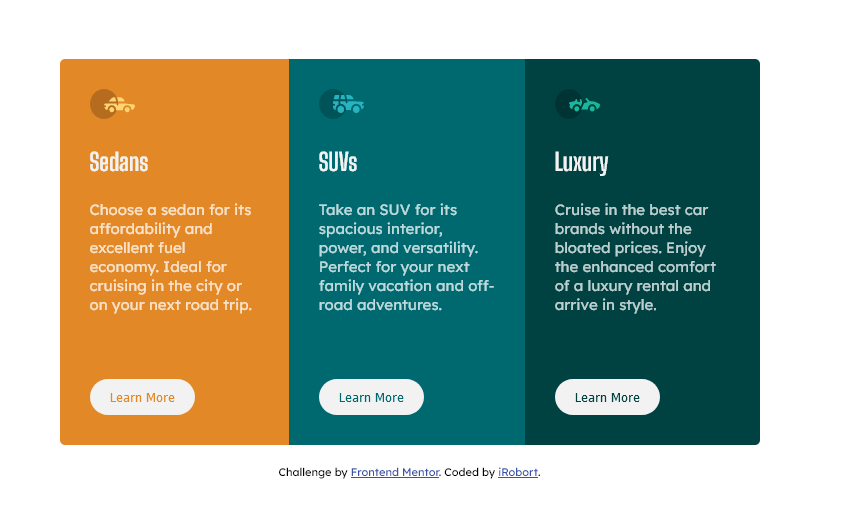

# Frontend Mentor - 3-column preview card component solution

This is a solution to the [3-column preview card component challenge on Frontend Mentor](https://www.frontendmentor.io/challenges/3column-preview-card-component-pH92eAR2-). Frontend Mentor challenges help you improve your coding skills by building realistic projects. 

## Table of contents

- [Overview](#overview)
  - [The challenge](#the-challenge)
  - [Screenshot](#screenshot)
  - [Links](#links)
- [My process](#my-process)
  - [Built with](#built-with)
  - [What I learned](#what-i-learned)
- [Author](#author)
**Note: Delete this note and update the table of contents based on what sections you keep.**

## Overview

### The challenge

Users should be able to:

- View the optimal layout depending on their device's screen size
- See hover states for interactive elementss

### Screenshot




### Links

- Solution URL: https://coding180.com/frontend-mentor/3-column-preview-card/
- Live Site URL: https://coding180.com/frontend-mentor/3-column-preview-card/

## My process

### Built with

- Semantic HTML5 markup
- CSS custom properties
- SaaS
- Flexbox
- CSS Grid
- Mobile-first workflow


### What I learned

This project helped me to verify my css flex box skills.
I used flexbox for the entire container to properly align the three boxes. 
I also Used @media query and flex dirction to align the boxes both vertically and horizontally for mobile and desktop version respectively.

With a little scale animation, I have been able to change the hover state of each buttons in the box to show interactive elements.

Initially I had issues centering the box to the center on desktop version, but I have been able to accomplish that by setting justify-contents and align-items to center on the flexbox.

Some of the snippets I'm proud of:


```css
// to align boxes vertically and horizontally
body {
    flex-direction: column;
    justify-content: center;
    align-items: center;
}
// hover state change
    button:hover {
        transform: scale(1.1);
    }
```


## Author

- Website - [Robort Gabriel](https://robortdev.com)
- Frontend Mentor - [@coding-robort](https://www.frontendmentor.io/profile/coding-robort)
- Twitter - [@coding_robort](https://www.twitter.com/coding_robort)

